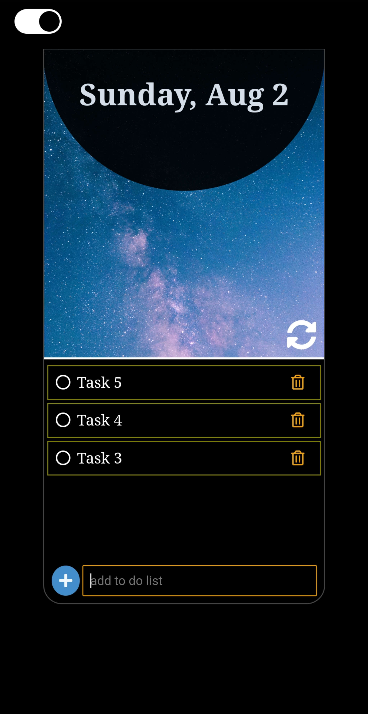
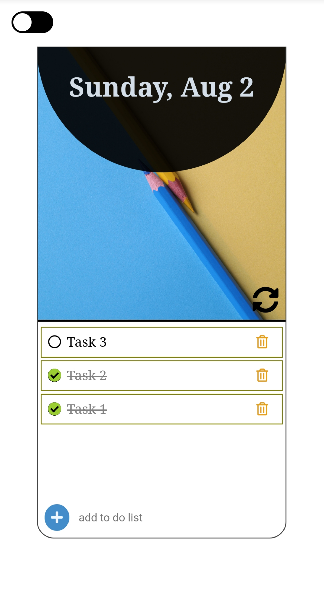

# To-do-list

It is a simple to-do list, made using javascript which allows you to add task, mark it as done and delete it after completing the task. You can clear all task using the clear icon.
Your task get stored in local storage which stores the list untill you manually delete it.
You can use the toggle to switch to light or dark mode.

It can be easily accessed using the link:
https://gracious-heyrovsky-38c1ea.netlify.app/

#### Since this project is made to test my basic  javascript skills, it's not an end product yet.
#### I'll be making changes to it as I keep learning.
#### I am always open to suggestions, feedback and issues to work on.
